# T04: Serveis de directori. LDAP

1. Comprobar el nom de servidor i el domini de la xarxa

Primer com sempre, farem una actualització del sistema per que estigui tot correcte i actualitzat.

sudo apt update && sudo apt upgrade -y

Seguidament, haurem de deixar les configuracions així per poder modificar el domini.

sudo nano /etc/hosts

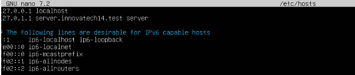

Llavors per comprovar que tenim configurat el servidor i el domini de la xarxa de forma correcte, haurem de fer el següent.

hostname

hostname -f

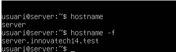

I si volem modificar el nom del servidor haurem d'utilitzar la següent comanda.

sudo hostnamectl set-hostname server

Si ja tenim configurats els adaptadors correctament (Adaptador1: Xarxa NAT o Adaptador pont i Adaptador2: host-only) podrem començar amb la instal·lació de l’eina OpenLDAP.

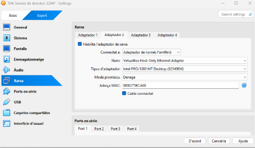

2. Instal·lació del servei i les seves utilitats

Ara començarem amb la instal·lació del server LDAP on utilitzarem la següent comanda “sudo apt install slapd lapd ldap-utils -y”. 

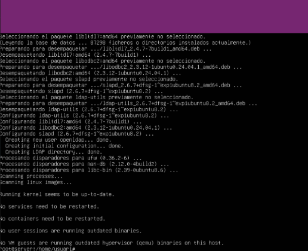

Seguidament haurem de comprovar que el servei Slapd funciona correctament i esta actiu.

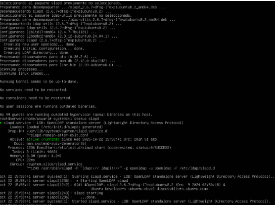

Ara, comprovem que el directori s’ha creat correctament.

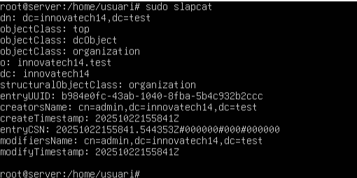

En el cas que haguem configurat el nom del domini d’instal·lar el servei haurem de reconfigurar-lo amb les preferències del document.

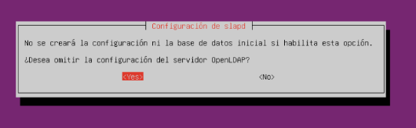

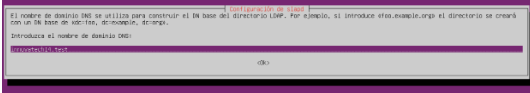

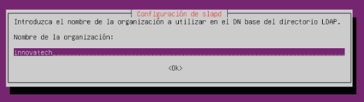

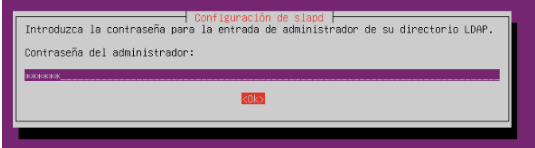

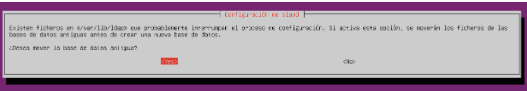

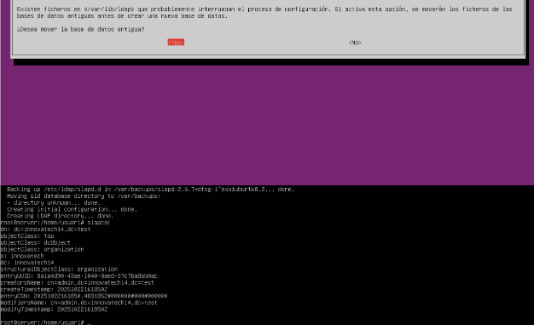

Tornem a revisar els canvis que hem fet a l’eina. (sudo slapcat)

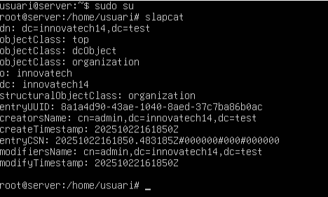

3. Tasques d’implementació i configuració del servidor LDAP

El client, ens demana crear dos UnitatsOrganitzatives, llavors, ara crearem amb extensió “.ldif”: sudo nano OU_users.ldif
I seguidament, haurem d’introduir el següent contingut:

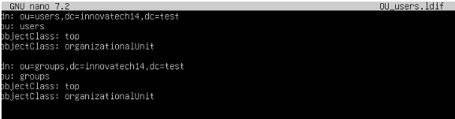

Tot seguit, haurem d’introduir el seguent directori 
ldapadd -D “cn=admin,dc=innovatech14,dc=test” -W -f OU_users.ldif

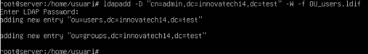

Seguidament, haurem de revisar que la OUs s’han creat correctament en el directori.
ldapsearch -x -LLL -b “dc=innovatech14,dc=test” ou

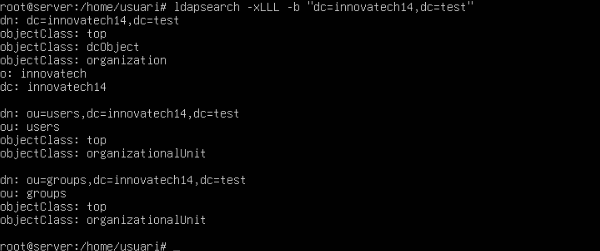

Ara, en el cas que haguessim d’eliminar un OU, hauriem de executar la següent comanda:

ldapdelete -D “cn=admin,dc=innovatech14,dc=test” -W “ou=groups,dc=innovatech14,dc=test

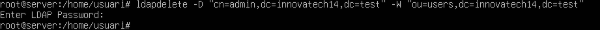

4. Implementació del gestor d’usuaris de LDAP  LAM

Tot seguit, haurem d’instal·lar el gestor LDAP LAM.
Primer de tot haurem d’actualitzar el sistema amb:
sudo apt upgrade && apt update

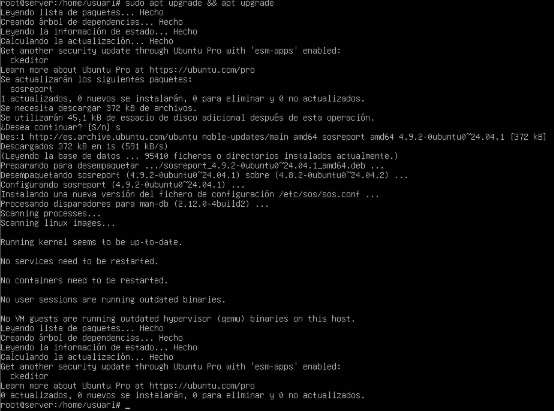

I després farem per la instal·lació:
sudo apt install ldap-account-manager -y

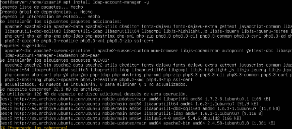

5. Gestió i Administració (LAM)

Per gestionar i administrar el (LAM) entrarem al gestor gràfic des de la màquina física amb l’url:
http://192.168.56.103/lam/templates/login.php

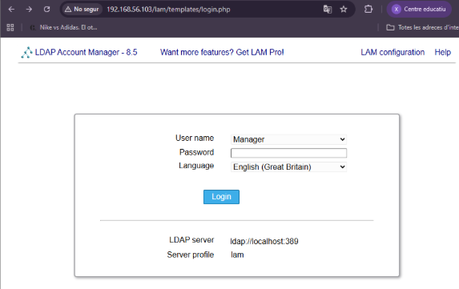

Ara anirem a la part que diu “editar perfiles de servidor”.

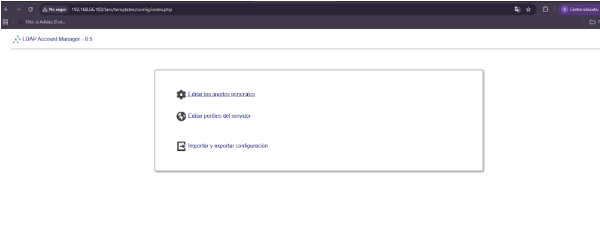

Seguidament, de contrasenya posarem “lam” que es la que ve per defecte, per així, poder cambiarla.

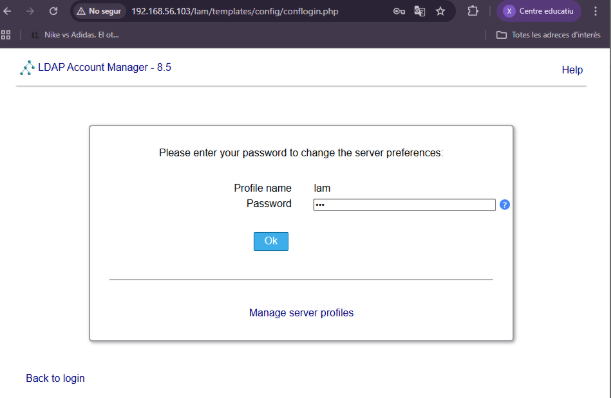

Ara configurarem el idioma, compte i admin:

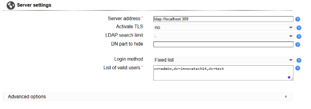

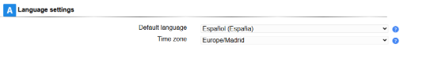

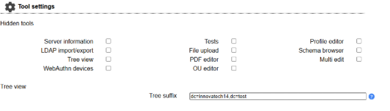

Seguidament, a la pestanya “Tipos de cuentas” configurem els OUs per els nostres usuaris i grups:

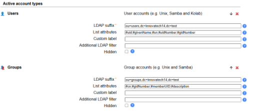

I ara farem clic a “guardar”.

La primera vegada ens demana si les volem crear al perfil del servidor LAM, les creem.

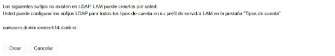

En el següent apartat, crearem dos grups de seguretat al directori “tech i manager”.

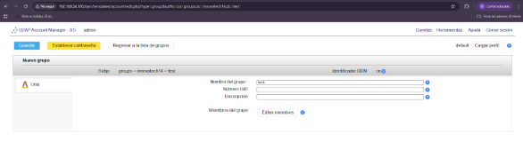

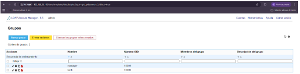

Després haurem de crear dos usuaris; tech01 i manager01, a part asignar cada usuari al seu grup.

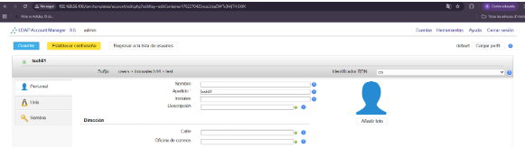

I assignarem cada usuari al seu grup.

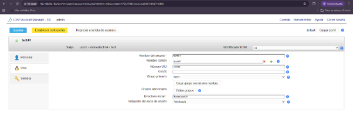

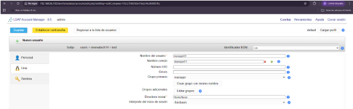

Finalment haurem configurat i administrat el LAM (gestor d’usuaris LDAP) amb l’eina gràfica.

6. Integració de Client (Client Ubuntu Desktop)
   
Ens caldrà treballar des d’un client amb Zorin o Ubuntu. Si no en disposem d’un, haurem de crear una màquina virtual amb aquest sistema operatiu. En aquesta màquina, caldrà configurar l’adaptador de xarxa en mode NAT, igual que al servidor, per tal que ambdues màquines puguin comunicar-se.
Si la configuració és correcta, hauríem de poder fer un ping entre les dues màquines i obtenir resposta.

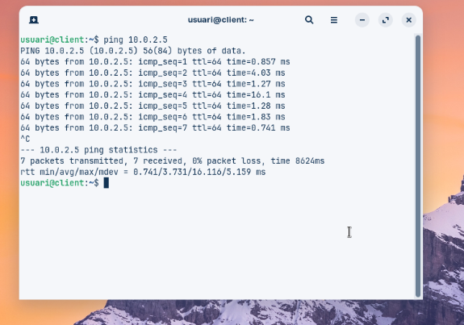

Tot seguit, configurarem el hostname i asignarem un nom a l’ip del nostre servidor modificant l’arxiu /etc/hosts amb sudo nano /etc/hosts i el deixarem tal que així.

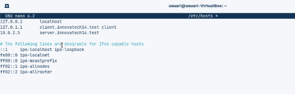

Ara si fem ping al nom del servidor hauriem de fer ping a l’ip pero de forma “traduïda”.

ping server.innovatech24.test

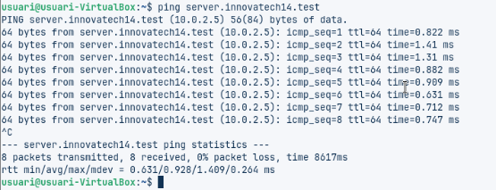

Per veure el hostname haurem d'utilitzar la següent comanda:

hostname -f

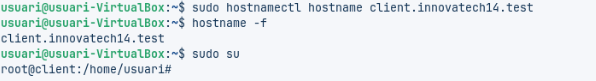

7. Instal·lació per gestionar ldap i els seus usuaris

Ara instal·larem els paquets per gestionar ldap i els seus usuaris

sudo apt install libnss-ldapd libpam-ldapd nslcd -y

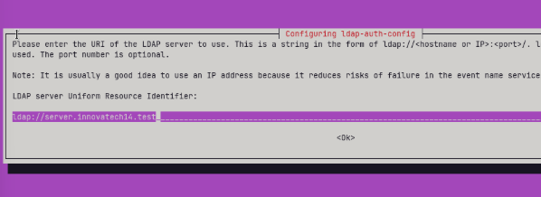

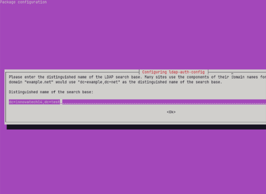

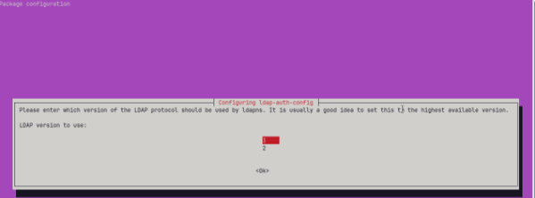

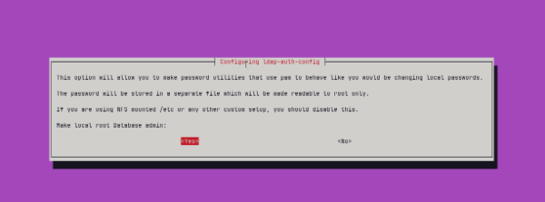

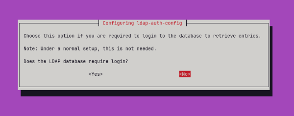

Un cop instal·lat correctament podem verificar que ho hem fet bé i que detecta la configuració de ldap amb aquesta comanda:

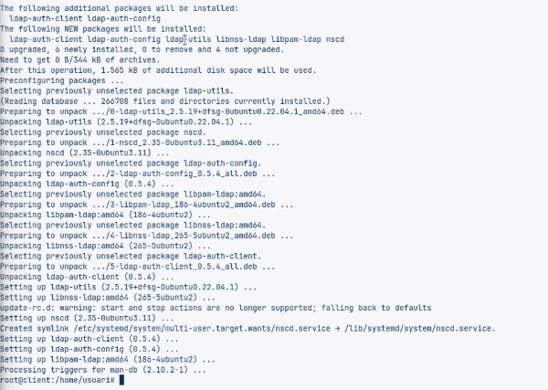

Seguidament haurem de modificar les extensions següents:

Primer de tot haurem de modificar l’extensió /etc/nsswitch.conf amb ldap en passwd, group. sudo nano /etc/nsswitch.conf.

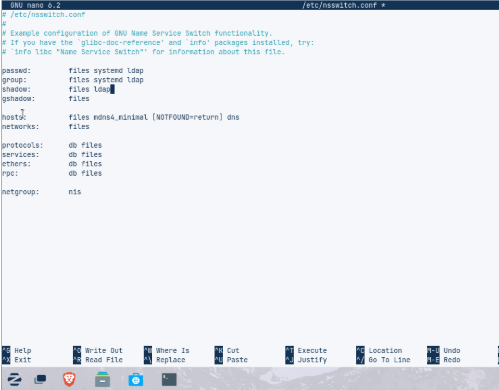

Ara, modificarem /etc/pam.d/common-password i comentar la línea marcada  sudo nano /etc/pam.d/common-password

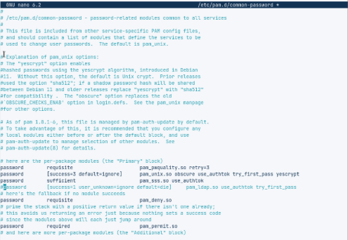

Seguidament, haurem d’ edita /etc/pam.d/common-session i afegir la següent linea: “session optional pam_mkhomedir.so skel=/etc/skel umask =077”

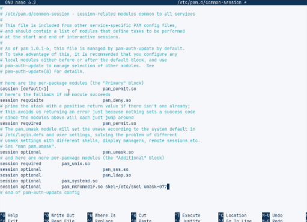

Finalment, l’última extensió que haurem de modificar és
/etc/pam.d/gdm-launch-environment per activar l’autenticació LDAP. 

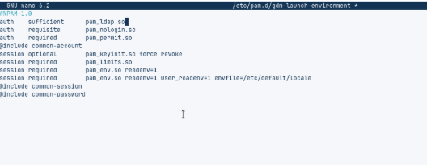

Ara per finalitzar, haurem d’agafar els usuaris de ldap amb la comanda següent:
getent passwd | tail

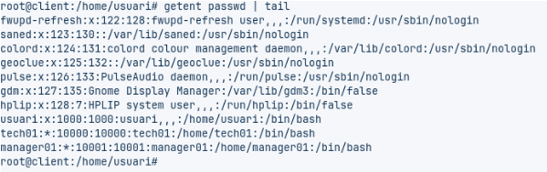

Si els canvis anteriors han funcionat correctament, ja podem reiniciar la màquina i iniciar sessió amb un dels usuaris.

Ara entrem a la màquina del client amb uns dels dos usuaris que hagim creat, en aquest cas entrarem amb l'usuari “tech01”.

Un cop iniciat sessió podrem veure que l’usuari té el grup que hem assignat anteriorment i que s’han creat correctament els seus directoris.

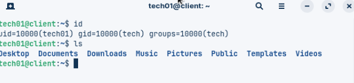

Ara ja podem accedir als diferents usuaris gestionats que hem creat a l’LDAP des de la o les nostres màquines.

